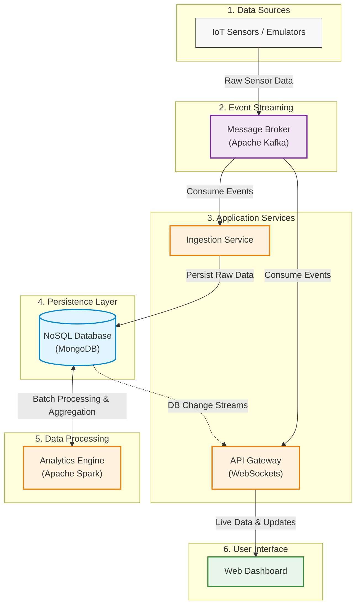

# 🏙️ Smart City IoT Monitor: Big Data Pipeline

A comprehensive IoT data pipeline designed for smart city monitoring, featuring real-time telemetry, batch analytics, and an interactive live dashboard. This project demonstrates a full-cycle Big Data architecture using Kafka, Spark, MongoDB, and React.

---

## 🏗️ Architecture Overview

The system follows a microservices-based architecture to ensure scalability and separation of concerns.



### Data Flow Breakdown
1.  **Sensor Emulation**: Simulates multiple IoT sensors (Traffic, Humidity, Temperature, etc.) across different city zones.
2.  **Messaging Hub**: Apache Kafka acts as the central nervous system, decoupling data producers from consumers.
3.  **Storage & Ingestion**: The Ingestion service captures raw events, while Apache Spark processes batch analytics (averages, maximums, counts).
4.  **Real-time API**: A Flask-based Gateway uses MongoDB Change Streams and Kafka subscriptions to push updates to the UI instantly.
5.  **Visualization**: A modern React dashboard provides live charts and status monitoring.

---

## 🚀 Tech Stack

-   **Backend**: Python (Flask, Flask-SocketIO)
-   **Big Data**: Apache Spark (PySpark), Apache Kafka
-   **Database**: MongoDB
-   **Frontend**: React, Vite, TypeScript, Tailwind CSS, Recharts
-   **Infrastructure**: Docker, Docker Compose

---

## 📂 Project Structure

| Directory | Description |
| :--- | :--- |
| `sensor-emulator-service` | Generates synthetic IoT data and publishes it to Kafka. |
| `data-ingestion-service` | Consumes raw data from Kafka and persists it to MongoDB. |
| `batch-analytics-service` | PySpark application for calculating city-wide sensor metrics. |
| `realtime-gateway-service` | WebSocket hub connecting the database/Kafka to the frontend. |
| `dashboard` | Interactive React application for data visualization. |
| `mongodb_init` | Database initialization scripts and replica set configuration. |

---

## 🛠️ Getting Started

### Prerequisites
-   [Docker](https://www.docker.com/get-started) & [Docker Compose](https://docs.docker.com/compose/install/)
-   Python 3.9+ (Optional, for local development)

### 1. Clone the Repository
```bash
git clone https://github.com/your-username/IoT-Big-Data-Project.git
cd IoT-Big-Data-Project
```

### 2. Environment Configuration
Copy the example environment file and update the variables if necessary.
```bash
cp .env.example .env
```

### 3. Launch the Application
Run the entire stack using Docker Compose:
```bash
docker-compose up --build
```
*Note: The first launch might take a few minutes as it downloads images and initializes the MongoDB replica set.*

### 4. Access the Services
-   **Interactive Dashboard**: [http://localhost:5051](http://localhost:5051)
-   **Realtime API Health**: [http://localhost:5050/healthz](http://localhost:5050/healthz)
-   **MongoDB**: `localhost:27017`

---

## 📡 API & Data Documentation

For detailed information about WebSocket events, data schemas, and REST endpoints, please refer to the [API Documentation](api_documentation.md).

### Sample Sensor Data Structure
```json
{
  "sensor_id": "tra-north-1",
  "type": "traffic",
  "zone": "North",
  "value": 85,
  "timestamp": "2024-04-30T14:30:00Z"
}
```

---

## 🛠️ Development & Contributing

If you wish to contribute or run services individually:

1.  **Install dependencies locally**:
    ```bash
    pip install -r requirements.txt
    ```
2.  **Running the Dashboard**:
    ```bash
    cd dashboard
    npm install
    npm run dev
    ```

---

## 📄 License

This project is licensed under the MIT License - see the [LICENSE](LICENSE) file for details (or create one).

---
*Created as part of the Big Data Course.*
